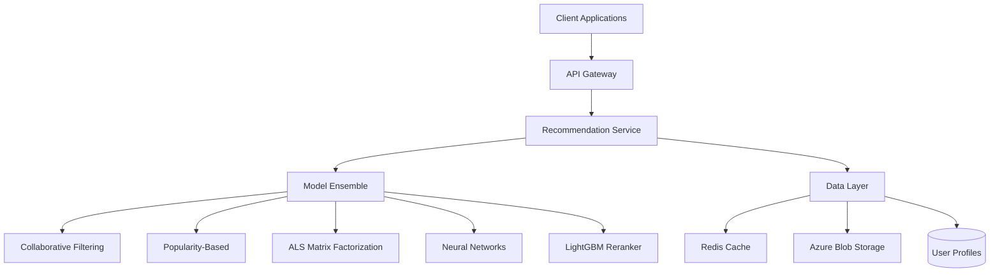
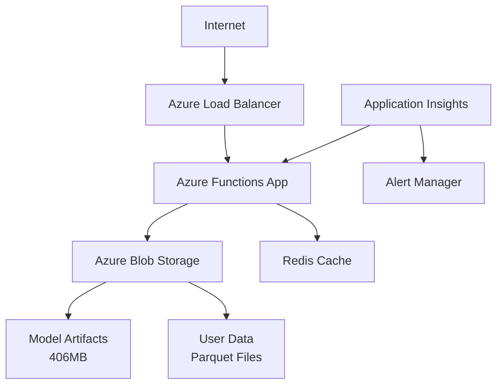
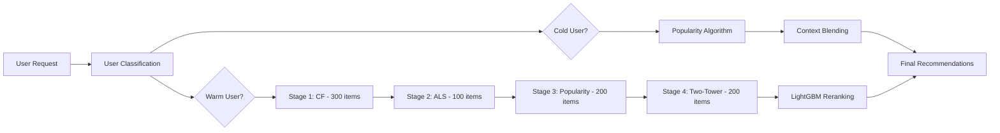
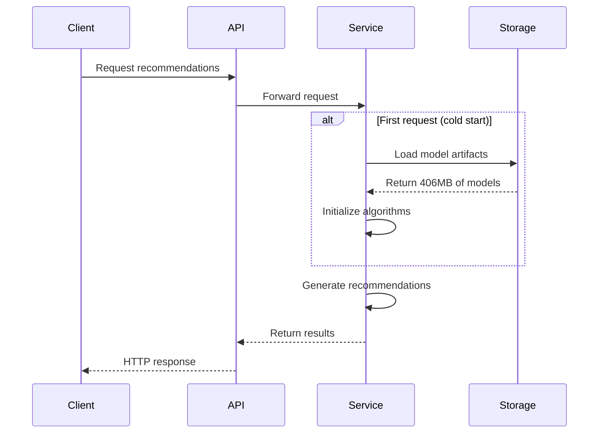

# System Architecture

Overview of the recommendation system architecture and design principles.

## High-Level Architecture

## Core Components

### 1. API Layer
- **Azure Functions**: Serverless compute platform
- **RESTful API**: Standard HTTP/JSON interface
- **Authentication**: Optional API key validation
- **Rate Limiting**: Request throttling and quotas

### 2. Recommendation Service
- **User Classification**: Cold vs warm user detection
- **Context Resolution**: Profile loading and override handling
- **Algorithm Orchestration**: Multi-model ensemble coordination
- **Response Formatting**: Standardized output structure

### 3. Model Ensemble
Multiple algorithms working together:

#### Cold Users (Context-Aware)
- **Global Popularity**: Most popular items overall
- **Device-Specific**: Popular on user's device type
- **Regional**: Popular in user's geographic region
- **Temporal**: Recently trending items

#### Warm Users (Personalized)
- **Collaborative Filtering**: User-user similarity recommendations
- **ALS Matrix Factorization**: Latent factor modeling
- **Two-Tower Neural Network**: Deep learning embeddings
- **LightGBM Reranking**: ML-based final scoring

### 4. Data Layer
- **Model Artifacts**: Pre-computed recommendations and embeddings
- **User Profiles**: Device, OS, country information
- **Interaction History**: Click and engagement data
- **Feature Store**: Engineered features for reranking

## Deployment Architecture

### Cloud Infrastructure

### Compute Resources
- **Azure Functions**: Consumption plan with auto-scaling
- **Memory**: 1.5GB allocated for model loading
- **Cold Start**: ~5-10 seconds for initial model loading
- **Warm Instances**: Sub-second response times

### Storage Architecture
- **Blob Storage**: Model artifacts and datasets
- **Hot Tier**: Frequently accessed models
- **Cool Tier**: Historical data and backups
- **Redundancy**: Geo-redundant storage (GRS)

## Algorithm Architecture

### Multi-Stage Pipeline

### Feature Engineering
For LightGBM reranking:
1. **CF Score**: Collaborative filtering confidence
2. **ALS Score**: Matrix factorization rating prediction
3. **Popularity Score**: Global and contextual popularity
4. **Neural Score**: Two-tower model embedding similarity
5. **User-Item Affinity**: Historical interaction patterns
6. **Temporal Score**: Recency and trending factors

## Data Flow

### Request Processing
1. **API Gateway**: Receives HTTP request
2. **Input Validation**: Parameter checking and sanitization
3. **User Classification**: Determine cold/warm status
4. **Context Resolution**: Load/override user profile
5. **Algorithm Selection**: Route to appropriate pipeline
6. **Candidate Generation**: Multi-stage recommendation
7. **Response Formatting**: Structure output JSON

### Model Loading

## Scalability Design

### Horizontal Scaling
- **Stateless Services**: No server-side session storage
- **Function Instances**: Auto-scaling based on demand
- **Load Distribution**: Azure's built-in load balancing
- **Regional Deployment**: Multi-region for global users

### Performance Optimization
- **Model Caching**: Keep models in memory between requests
- **Lazy Loading**: Load artifacts only when needed
- **Batch Processing**: Group operations where possible
- **Pre-computation**: Offline candidate generation

### Monitoring and Observability
- **Application Insights**: Detailed telemetry and logging
- **Performance Metrics**: Response times, success rates
- **Custom Dashboards**: Business and technical KPIs
- **Alerting**: Automated incident detection

## Security Architecture

### Data Protection
- **Encryption in Transit**: HTTPS/TLS for all communications
- **Encryption at Rest**: Azure Storage encryption
- **Access Control**: Role-based access to resources
- **Data Minimization**: Store only necessary user data

### API Security
- **Input Validation**: Strict parameter checking
- **Rate Limiting**: Prevent abuse and DDoS
- **CORS Configuration**: Cross-origin request control
- **Audit Logging**: Track all API interactions

## Technology Stack

### Core Technologies
- **Language**: Python 3.10+
- **Framework**: Azure Functions
- **ML Libraries**: 
  - pandas, numpy (data processing)
  - lightgbm (gradient boosting)
  - implicit (matrix factorization)
  - scikit-learn (utilities)

### Infrastructure
- **Cloud Platform**: Microsoft Azure
- **Compute**: Azure Functions (Consumption)
- **Storage**: Azure Blob Storage
- **Monitoring**: Application Insights
- **CI/CD**: GitHub Actions

### Development Tools
- **Version Control**: Git with GitHub
- **Testing**: pytest with comprehensive test suite
- **Documentation**: Markdown with Mermaid diagrams
- **Local Development**: Azure Functions Core Tools

## Design Principles

### 1. Modularity
- **Pluggable Algorithms**: Easy to add/remove models
- **Interface Contracts**: Consistent API between components
- **Separation of Concerns**: Clear responsibility boundaries

### 2. Scalability
- **Stateless Design**: No server-side state dependencies
- **Auto-scaling**: Demand-driven resource allocation
- **Performance First**: Optimize for response time

### 3. Reliability
- **Graceful Degradation**: Fallback algorithms for failures
- **Circuit Breakers**: Prevent cascade failures
- **Health Monitoring**: Proactive issue detection

### 4. Maintainability
- **Clean Code**: Readable and well-documented
- **Comprehensive Testing**: Unit, integration, and system tests
- **Version Control**: Proper branching and release management

## Future Architecture

### Planned Enhancements
1. **Real-time Learning**: Online model updates
2. **A/B Testing Framework**: Algorithm comparison platform
3. **Feature Store**: Centralized feature management
4. **Stream Processing**: Real-time interaction processing
5. **Multi-tenancy**: Support for multiple clients

### Technology Evolution
- **Kubernetes**: Container orchestration for complex deployments
- **Apache Kafka**: Real-time event streaming
- **MLflow**: ML lifecycle management
- **Redis**: Distributed caching layer
- **GraphQL**: More flexible API querying