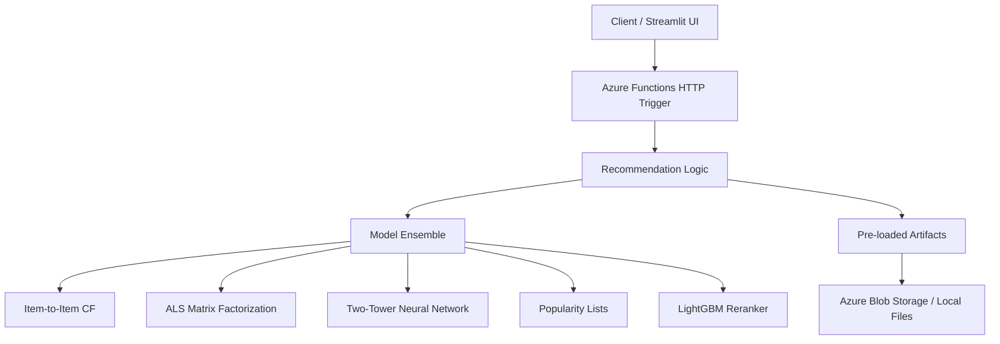
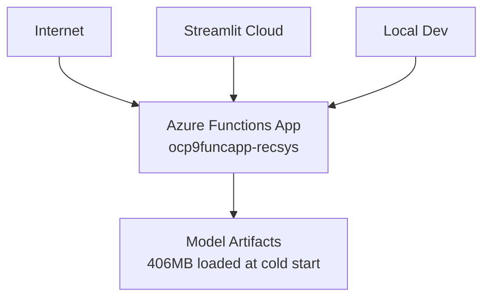
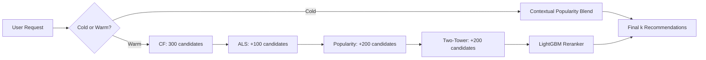

# System Architecture

Overview of the recommendation system as currently implemented.

## High-Level Architecture

## Core Components

### 1. API Layer (`deployment/azure_functions/`)
- **Azure Functions v2** (Python decorator model, anonymous auth)
- **Single POST endpoint**: `/api/reco`
- **Input validation**: user_id range check, JSON parsing
- **No authentication or rate limiting** in current deployment

### 2. Recommendation Logic (`deployment/azure_functions/HttpReco/__init__.py`)
- **User classification**: Cold (last_click == -1) vs warm
- **Context resolution**: Stored user profile + optional env overrides
- **Algorithm routing**: Cold → contextual popularity blend; Warm → ensemble + reranking

### 3. Model Ensemble

#### Cold Users (Context-Aware Popularity)
- **Global by OS**: Top items for the user's operating system
- **Global by device**: Top items for the user's device group
- **Regional by OS**: Top items for OS + country combination
- **Regional by device**: Top items for device + country combination
- **Global fallback**: Fill remaining slots from overall popularity list

#### Warm Users (Personalized Ensemble)
- **Item-to-Item CF**: Up to 300 candidates from last-clicked item similarity
- **ALS Matrix Factorization**: Up to 100 additional candidates
- **Global Popularity**: Up to 200 additional candidates
- **Two-Tower Neural Network**: Up to 200 additional candidates
- **LightGBM Reranker**: Final scoring of the ~800-1000 candidate pool

### 4. Data Layer
- **Model artifacts** (~406MB): `.npy` arrays, LightGBM model file, `.pkl` popularity tables, `.parquet` ground truth
- **User profiles**: Device, OS, country extracted from `valid_clicks.parquet`
- **All artifacts loaded once** at Azure Functions cold start and kept in memory

## Deployment Architecture

### Compute
- **Azure Functions**: Consumption plan (auto-scaling, pay-per-execution)
- **Cold start**: ~5-10 seconds (loads all artifacts into memory)
- **Warm requests**: Sub-second response times

### Storage
- Artifacts are bundled with the function app or loaded from `external_runtime_assets/azure/artifacts/` locally

## Algorithm Pipeline

### Multi-Stage Candidate Generation (Warm Users)

### Feature Engineering (6 features for LightGBM)
1. **CF rank**: Position in CF candidate list (or 1001 if absent)
2. **ALS rank**: Position in ALS candidate list (or 1001 if absent)
3. **Popularity rank**: Position in popularity list (or 1001 if absent)
4. **Two-Tower rank**: Position in neural candidate list (or 1001 if absent)
5. **Overall rank**: Position in the combined candidate pool
6. **Cosine similarity**: User–item embedding dot product (Two-Tower vectors)

## Request Flow

1. **POST /api/reco** received by Azure Functions
2. **JSON parsed**, user_id validated against `last_click` array length
3. **User profile loaded** from `valid_clicks.parquet` data, env overrides applied
4. **Cold/warm check**: `last_click[user_id] == -1` → cold path
5. **Candidate generation** (warm) or **popularity blend** (cold)
6. **LightGBM reranking** (warm users only)
7. **JSON response** with recommendations, ground_truth, and user_profile

## Technology Stack

- **Language**: Python 3.10+
- **API Framework**: Azure Functions v2 (decorator model)
- **Validation**: Pydantic (in `src/api.py`); manual checks in deployed function
- **ML**: NumPy, LightGBM, pandas, pyarrow
- **Frontend**: Streamlit (deployed on Streamlit Cloud)
- **Testing**: pytest with unittest.mock
- **Local dev**: Azure Functions Core Tools

## Design Principles

### Modularity
- `src/` contains a clean OOP architecture (`Config`, `ModelRegistry`, `RecommendationService`)
- `deployment/azure_functions/HttpReco/` contains the production-optimized flat implementation
- Both share the same algorithmic logic

### Graceful Degradation
- Cold-start popularity blend fills missing buckets from global list
- Missing popularity tables fall back to `pop_list.npy`
- Missing ground truth / user profiles are tolerated (logged as warnings)

### Stateless Design
- All state is loaded once at cold start from artifact files
- No external database or cache dependencies at runtime